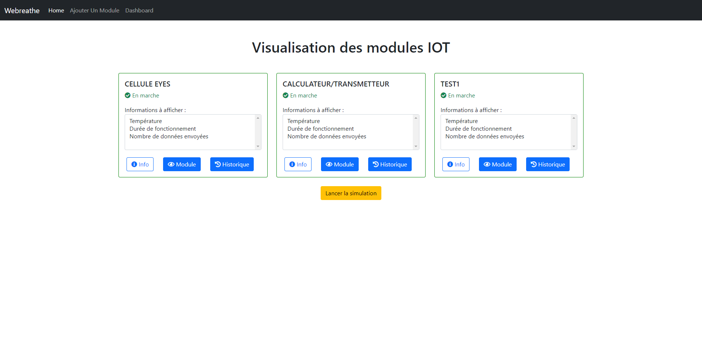

<h1 align="center">Test Webreathe</h1>

## Table of Contents

- [Overview](#overview)
- [Installation](#installation)
- [Simulation](#simulation)
- [Contact](#contact)

## Overview

Depuis plusieurs années, les objets connectés à internet se multiplient, cependant les outils pour vérifier leur fonctionnement et leur disponibilité restent rares. Le sujet de ce test est le développement d’un site web de monitoring de modules IOT.

Les technologies de programmation utilisées sont HTML / CSS / PHP / Bootstrap / SQL / Javascript.

## Installation

Les tables de la BDD se trouve dans le dossier database.
Les identifiants à remplacer par les vôtres pour se connecter à la BDD se trouve dans src/connect.php.

## Simulation

Le déroulement de la simulation est fait de sorte que la température de chaque module varie de plus ou moins 0.1 à 1 degré, la durée de fonctionnement augmente de 1 et le nombre de données envoyées augmente de 27 chaque seconde. Lorsque la température est supérieure ou égale à 70, l'état du module passe de 1 (en marche) à 0 (arrêt) et la couleur de la carte change.

Il est possible de modifier le comportement de la simulation dans le fichier simulation.php.

## Contact

- GitHub [@Fixito](https://github.com/Fixito)
- Website [thomasrobert](https://fixito.github.io/thomasrobert/)
